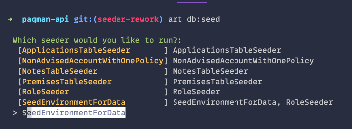

# Make db:seed interactive

[](https://packagist.org/packages/morrislaptop/laravel-seed-list)
[](https://github.com/morrislaptop/laravel-seed-list/actions?query=workflow%3Arun-tests+branch%3Amain)
[](https://github.com/morrislaptop/laravel-seed-list/actions?query=workflow%3A"Check+%26+fix+styling"+branch%3Amain)
[](https://packagist.org/packages/morrislaptop/laravel-seed-list)

---
Often forget what your seeder classes are called? This package can make `db:seed` interactive so you can see a list and choose which seeders to run (and which seeders will call). 



## Installation

You can install the package via composer:

```bash
composer require morrislaptop/laravel-seed-list
```

Configure your default seeder to extend the `LaravelSeedLister` provided by the package:

```php
<?php

namespace Database\Seeders;

use Morrislaptop\LaravelSeedList\LaravelSeedLister;

class DatabaseSeeder extends LaravelSeedLister
{
}
```

## Usage

```bash
php artisan db:seed
```

## Testing

```bash
composer test
```

## Changelog

Please see [CHANGELOG](CHANGELOG.md) for more information on what has changed recently.

## Contributing

Please see [CONTRIBUTING](.github/CONTRIBUTING.md) for details.

## Security Vulnerabilities

Please review [our security policy](../../security/policy) on how to report security vulnerabilities.

## Credits

- [Craig Morris](https://github.com/morrislaptop)
- [All Contributors](../../contributors)

## License

The MIT License (MIT). Please see [License File](LICENSE.md) for more information.
